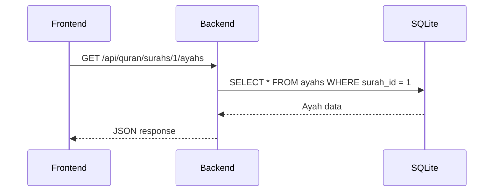
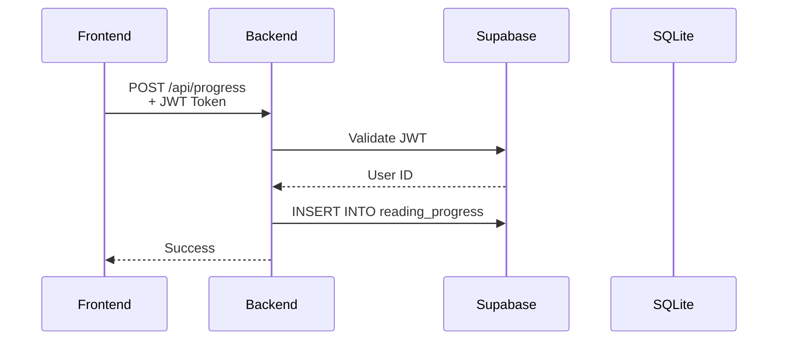
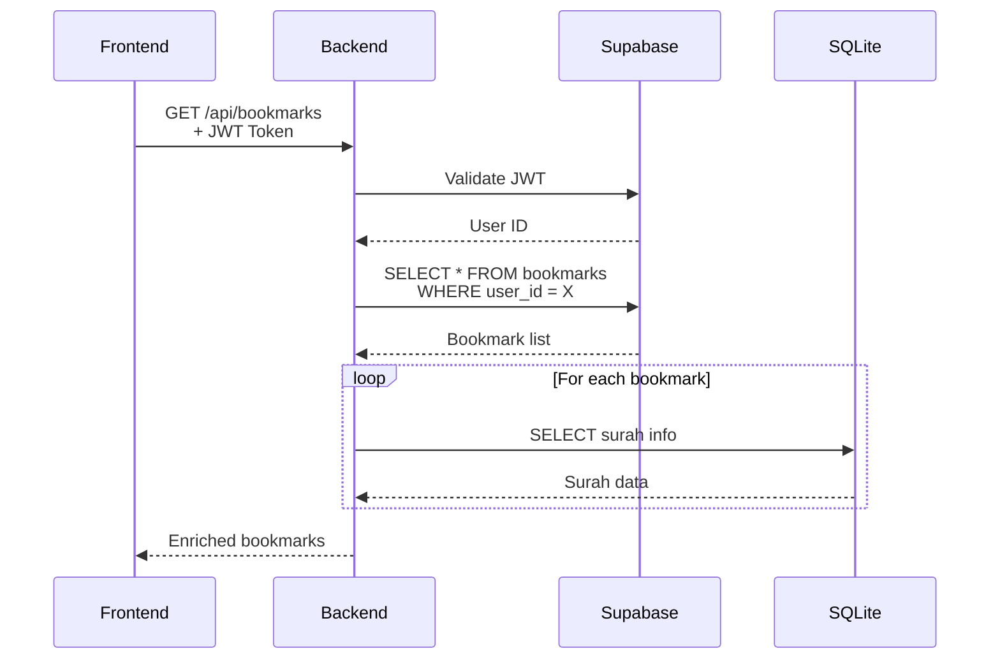

# Database Architecture Documentation

This document provides detailed technical information about the hybrid database architecture used in the Quran Reader application.

## Overview

The Quran Reader uses a **hybrid database architecture** that separates concerns between:
- **SQLite3**: Static Quran content (read-only)
- **Supabase PostgreSQL**: Dynamic user data (read-write with authentication)

## Architecture Decision: Why Hybrid?

### The Problem

Quran applications face a unique data challenge:
- **Quran content** is large (40MB+), static, and accessed frequently
- **User data** is small (KB per user), dynamic, and requires authentication

### Why Not Put Everything in Supabase?

| Factor | All Supabase | Hybrid Approach |
|--------|--------------|-----------------|
| **Bandwidth** | Every Quran query hits the cloud | Quran queries are local (0 network) |
| **Cost** | Higher compute/bandwidth usage | Minimal cloud usage |
| **Latency** | 50-200ms per query | <5ms for Quran data |
| **Auth** | Required for everything | Only required for user features |
| **Offline Support** | Not possible | Quran available offline |

### Why Not Put Everything in SQLite?

| Factor | All SQLite | Hybrid Approach |
|--------|-----------|-----------------|
| **Authentication** | Must implement manually (passwords, JWT, etc.) | Supabase Auth built-in |
| **Multi-device** | Difficult to sync across devices | Easy with cloud database |
| **Security** | App-level security only | Database-level RLS |
| **Social Login** | Must implement each provider | Built-in (Google, GitHub, etc.) |
| **Real-time** | Must implement websockets | Built-in with Supabase |

## Database Schemas

### SQLite3 Schema (Quran Content)

Located at: `quran-dump/quran.db`

#### Table: `surahs`
Chapter metadata for all 114 surahs.

| Column | Type | Description |
|--------|------|-------------|
| `id` | INTEGER | Primary key, surah number (1-114) |
| `name` | TEXT | Arabic name (e.g., "الفاتحة") |
| `english_name` | TEXT | English transliteration (e.g., "Al-Fatihah") |
| `english_name_translation` | TEXT | English translation of name |
| `revelation_type` | TEXT | "Meccan" or "Medinan" |
| `number_of_ayahs` | INTEGER | Total verses in surah |

#### Table: `ayahs`
Individual verses for each edition.

| Column | Type | Description |
|--------|------|-------------|
| `id` | INTEGER | Primary key |
| `number` | INTEGER | Global ayah number (1-6236) |
| `number_in_surah` | INTEGER | Ayah number within surah |
| `surah_id` | INTEGER | Foreign key to surahs.id |
| `edition_id` | INTEGER | Foreign key to editions.id |
| `text` | TEXT | The verse text |
| `juz` | INTEGER | Juz number (1-30) |
| `manzil` | INTEGER | Manzil number (1-7) |
| `page` | INTEGER | Page number in standard Madinah mushaf |
| `ruku` | INTEGER | Ruku number |
| `hizb_quarter` | INTEGER | Hizb quarter number |
| `sajda` | INTEGER | Sajdah (prostration) indicator |

**Index**: `surah_id`, `edition_id`, `number`

#### Table: `editions`
Text editions and translations.

| Column | Type | Description |
|--------|------|-------------|
| `id` | INTEGER | Primary key |
| `identifier` | TEXT | Unique identifier (e.g., "quran-uthmani", "en.sahih") |
| `language` | TEXT | ISO language code |
| `name` | TEXT | Native name |
| `english_name` | TEXT | English name |
| `format` | TEXT | Text format (e.g., "text") |
| `type` | TEXT | Type ("quran" or "translation") |
| `direction` | TEXT | Text direction ("ltr" or "rtl") |

#### Table: `audio_editions`
Audio recitation metadata.

| Column | Type | Description |
|--------|------|-------------|
| `id` | INTEGER | Primary key |
| `identifier` | TEXT | Reciter identifier (e.g., "ar.alafasy") |
| `bitrate` | TEXT | Audio quality (e.g., "128") |

#### Table: `audio_files`
Mapping of ayahs to audio files.

| Column | Type | Description |
|--------|------|-------------|
| `id` | INTEGER | Primary key |
| `ayah_number` | INTEGER | Global ayah number |
| `edition_id` | INTEGER | Foreign key to audio_editions.id |
| `file_path` | TEXT | Local file path |
| `url` | TEXT | Remote URL (backup) |

### Supabase PostgreSQL Schema (User Data)

#### Table: `profiles`
Extends Supabase Auth with user profile data.

| Column | Type | Constraints | Description |
|--------|------|-------------|-------------|
| `id` | UUID | PK, FK→auth.users | User ID from Supabase Auth |
| `email` | TEXT | | Email address |
| `name` | TEXT | NOT NULL | Display name |
| `created_at` | TIMESTAMPTZ | DEFAULT NOW() | Account creation |
| `updated_at` | TIMESTAMPTZ | DEFAULT NOW() | Last update |

**RLS Policies**:
- Users can view their own profile
- Users can update their own profile
- Trigger creates profile on user signup

#### Table: `reading_progress`
Per-surah reading position tracking.

| Column | Type | Constraints | Description |
|--------|------|-------------|-------------|
| `id` | UUID | PK, DEFAULT gen_random_uuid() | Unique ID |
| `user_id` | UUID | FK→auth.users, NOT NULL | User ID |
| `surah_id` | INTEGER | NOT NULL | Surah number |
| `last_read_ayah_id` | INTEGER | NOT NULL | Last ayah read |
| `last_read_ayah_number` | INTEGER | NOT NULL | Ayah number in surah |
| `total_ayahs_read` | INTEGER | DEFAULT 0 | Total ayahs read in surah |
| `last_read_date` | DATE | DEFAULT TODAY | Last reading date |
| `updated_at` | TIMESTAMPTZ | DEFAULT NOW() | Last update |

**Unique**: (user_id, surah_id)
**RLS**: Users can CRUD only their own records

#### Table: `daily_readings`
Reading streak tracking.

| Column | Type | Constraints | Description |
|--------|------|-------------|-------------|
| `id` | UUID | PK | Unique ID |
| `user_id` | UUID | FK→auth.users, NOT NULL | User ID |
| `read_date` | DATE | NOT NULL | Reading date |
| `ayahs_read` | INTEGER | DEFAULT 0 | Ayahs read this day |
| `created_at` | TIMESTAMPTZ | DEFAULT NOW() | Creation time |

**Unique**: (user_id, read_date)
**RLS**: Users can CRUD only their own records

#### Table: `completed_ayahs`
Individual verse completion tracking.

| Column | Type | Constraints | Description |
|--------|------|-------------|-------------|
| `user_id` | UUID | FK→auth.users, PK, NOT NULL | User ID |
| `ayah_id` | INTEGER | PK, NOT NULL | Ayah global ID |
| `surah_id` | INTEGER | NOT NULL | Surah number |
| `ayah_number` | INTEGER | NOT NULL | Ayah number in surah |
| `completed_at` | TIMESTAMPTZ | DEFAULT NOW() | Completion time |
| `is_sequential` | BOOLEAN | DEFAULT FALSE | Sequential completion flag |

**RLS**: Users can CRUD only their own records

#### Table: `completed_surahs`
Fully completed surahs tracking.

| Column | Type | Constraints | Description |
|--------|------|-------------|-------------|
| `id` | UUID | PK | Unique ID |
| `user_id` | UUID | FK→auth.users, NOT NULL | User ID |
| `surah_id` | INTEGER | NOT NULL | Surah number |
| `completed_at` | TIMESTAMPTZ | DEFAULT NOW() | Completion time |

**Unique**: (user_id, surah_id)
**RLS**: Users can CRUD only their own records

#### Table: `bookmarks`
User bookmarked verses.

| Column | Type | Constraints | Description |
|--------|------|-------------|-------------|
| `id` | UUID | PK | Unique ID |
| `user_id` | UUID | FK→auth.users, NOT NULL | User ID |
| `ayah_id` | INTEGER | NOT NULL | Ayah global ID |
| `surah_id` | INTEGER | NOT NULL | Surah number |
| `ayah_number_in_surah` | INTEGER | NOT NULL | Ayah position |
| `created_at` | TIMESTAMPTZ | DEFAULT NOW() | Bookmark time |

**Unique**: (user_id, ayah_id)
**RLS**: Users can CRUD only their own records

#### Table: `play_sessions`
Individual audio play sessions.

| Column | Type | Constraints | Description |
|--------|------|-------------|-------------|
| `id` | UUID | PK | Session ID |
| `user_id` | UUID | FK→auth.users, NOT NULL | User ID |
| `ayah_id` | INTEGER | NOT NULL | Ayah played |
| `surah_id` | INTEGER | NOT NULL | Surah number |
| `ayah_number` | INTEGER | NOT NULL | Ayah position |
| `audio_edition` | TEXT | DEFAULT 'ar.alafasy' | Reciter |
| `started_at` | TIMESTAMPTZ | DEFAULT NOW() | Start time |
| `completed_at` | TIMESTAMPTZ | NULLABLE | End time |
| `duration_seconds` | INTEGER | NULLABLE | Play duration |

**RLS**: Users can CRUD only their own records

#### Table: `replay_stats`
Aggregate replay analytics.

| Column | Type | Constraints | Description |
|--------|------|-------------|-------------|
| `user_id` | UUID | FK→auth.users, PK, NOT NULL | User ID |
| `ayah_id` | INTEGER | PK, NOT NULL | Ayah global ID |
| `play_count` | INTEGER | DEFAULT 1 | Times played |
| `total_duration_seconds` | INTEGER | DEFAULT 0 | Total listen time |
| `last_played_at` | TIMESTAMPTZ | DEFAULT NOW() | Last play time |

**RLS**: Users can CRUD only their own records

#### Table: `quran_play_sessions`
Full Quran play mode sessions.

| Column | Type | Constraints | Description |
|--------|------|-------------|-------------|
| `id` | UUID | PK | Session ID |
| `user_id` | UUID | FK→auth.users, NOT NULL | User ID |
| `start_surah_id` | INTEGER | NOT NULL | Starting surah |
| `start_ayah_number` | INTEGER | NOT NULL | Starting ayah |
| `end_surah_id` | INTEGER | NULLABLE | Ending surah |
| `end_ayah_number` | INTEGER | NULLABLE | Ending ayah |
| `audio_edition` | TEXT | DEFAULT 'ar.alafasy' | Reciter |
| `started_at` | TIMESTAMPTZ | DEFAULT NOW() | Start time |
| `ended_at` | TIMESTAMPTZ | NULLABLE | End time |
| `ayahs_played` | INTEGER | DEFAULT 0 | Ayahs played |

**RLS**: Users can CRUD only their own records

## Row Level Security (RLS)

All Supabase tables have RLS enabled with the following policies:

```sql
-- Example policy for reading_progress
CREATE POLICY "Users can view their own reading progress"
  ON public.reading_progress FOR SELECT
  USING (auth.uid() = user_id);

CREATE POLICY "Users can manage their own reading progress"
  ON public.reading_progress FOR ALL
  USING (auth.uid() = user_id)
  WITH CHECK (auth.uid() = user_id);
```

**Key Points**:
- `auth.uid()` returns the authenticated user's ID from Supabase Auth
- Policies are enforced at the database level, not application level
- Even with compromised API credentials, users cannot access other users' data
- Service role key bypasses RLS (used only for migrations/admin)

## Data Flow Examples

### Example 1: Reading a Surah (Public, No Auth)



**Database Queries**: 1 (SQLite only)
**Auth Required**: No
**Latency**: ~5ms

### Example 2: Updating Progress (Authenticated)



**Database Queries**: 1 (Supabase only)
**Auth Required**: Yes
**Latency**: ~50-100ms

### Example 3: Getting Bookmarks (Authenticated, Enriched)



**Database Queries**: 1 (Supabase) + N (SQLite, where N = bookmark count)
**Auth Required**: Yes
**Latency**: ~50-100ms + ~5ms per bookmark

## Environment Configuration

### Required Environment Variables

```bash
# Supabase Configuration
SUPABASE_URL=https://your-project.supabase.co
SUPABASE_ANON_KEY=your-anon-public-key
SUPABASE_SERVICE_ROLE_KEY=your-service-role-key  # Only for migrations
```

### Getting Supabase Credentials

1. Go to your Supabase project dashboard
2. Navigate to **Settings** → **API**
3. Copy the following:
   - **Project URL**: Your Supabase project URL
   - **anon public**: Safe to expose in frontend code
   - **service_role**: NEVER expose this (admin only)

## Migration Guide

### From SQLite-Only to Hybrid

If migrating from the old SQLite-only architecture:

1. **Create Supabase Project**
   ```bash
   # See README.md for detailed setup
   ```

2. **Run Migrations**
   ```sql
   -- Applied via Supabase dashboard or migration script
   -- See migrate-to-supabase.py
   ```

3. **Migrate Existing Data**
   ```bash
   export SUPABASE_SERVICE_ROLE_KEY=your-key
   python migrate-to-supabase.py
   ```

4. **Update Environment Variables**
   ```bash
   # Add to backend/.env or production environment
   SUPABASE_URL=https://your-project.supabase.co
   SUPABASE_ANON_KEY=your-anon-key
   ```

## Performance Considerations

### SQLite3 Performance

- **Read Operations**: <5ms for typical queries
- **Indexes**: Properly indexed on foreign keys
- **Connection Pooling**: Single connection per request (sufficient for reads)

### Supabase Performance

- **Read Operations**: 50-100ms (network latency included)
- **Write Operations**: 100-200ms
- **Connection Pooling**: Managed by Supabase client library
- **RLS Overhead**: Minimal (~1-2ms per query)

### Optimization Strategies

1. **Batch Operations**: Fetch multiple bookmarks in one query
2. **Caching**: Cache Quran data in memory (never changes)
3. **Selective Queries**: Only fetch needed columns
4. **Pagination**: Limit results for large datasets

## Backup Strategy

### SQLite3 Backup

- **Location**: `quran-dump/quran.db`
- **Backup Method**: File copy (git LFS or external storage)
- **Frequency**: Only when Quran data changes (rarely)
- **Retention**: Permanent (static data)

### Supabase Backup

- **Method**: Supabase automated backups
- **Frequency**: Daily (included in free tier)
- **Retention**: 7 days (free tier), 30 days (pro tier)
- **Point-in-Time Recovery**: Available on pro tier

## Security Best Practices

### API Keys

- **anon key**: Safe for frontend, can only access user's own data (with valid JWT)
- **service_role key**: NEVER commit to git, only use for migrations
- **JWT tokens**: Store securely (httpOnly cookies recommended)

### RLS Policy Testing

Always test RLS policies:

```sql
-- Test as a specific user
SET LOCAL jwt.claims.sub = 'user-uuid-here';
SELECT * FROM reading_progress;
-- Should only return that user's data
```

### Rate Limiting

Implement rate limiting on auth endpoints:
- Registration: 5 per IP per hour
- Login: 20 per IP per minute
- Password reset: 3 per email per hour

## Troubleshooting

### Common Issues

#### Issue: "User not found" after migration
**Cause**: Profile not created (trigger failed)
**Fix**: Run `INSERT INTO profiles (id, email, name) SELECT id, email, name FROM auth.users;`

#### Issue: RLS policies blocking access
**Cause**: Policy using `auth.uid()` but no valid JWT
**Fix**: Ensure JWT token is sent in `Authorization: Bearer <token>` header

#### Issue: Slow queries on bookmarks
**Cause**: N+1 query problem (one query per bookmark)
**Fix**: Batch fetch surah data or add caching

## Additional Resources

- [Supabase Documentation](https://supabase.com/docs)
- [SQLite Documentation](https://www.sqlite.org/docs.html)
- [FastAPI Database Guide](https://fastapi.tiangolo.com/tutorial/sql-databases/)
