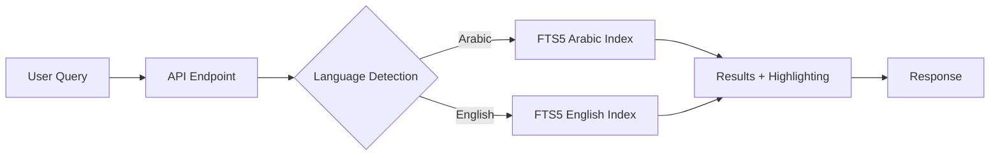
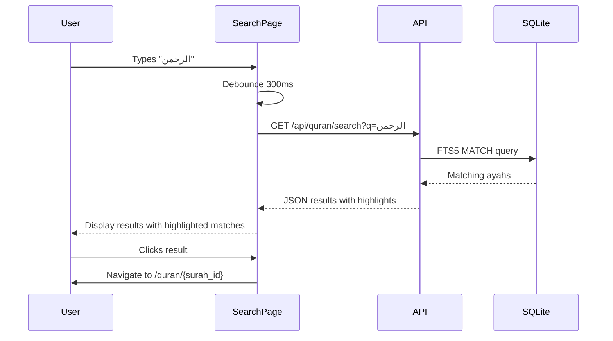

# Full-Text Search (FTS) for Quran Database

## Product Requirements Document

Implement high-performance, linguistically-aware full-text search across all Quran editions, supporting both Arabic (with diacritic-insensitive search) and English text.

---

## Background

The Quran Reader app currently has no verse-level search functionality. Users can only browse by surah or filter the surah list by name. This limits discoverability and makes it difficult to find specific verses.

### Current Database Structure

| Table | Content |
|-------|---------|
| `surahs` | 114 chapters with Arabic/English names |
| `ayahs` | 31,180 rows (6,236 verses × 5 editions) |
| `editions` | 5 text editions |

**Editions Available:**
- **Arabic**: `quran-uthmani` (with diacritics), `quran-simple` (simplified)
- **English**: `en.sahih`, `en.pickthall`, `en.yusufali`

### Arabic Text Challenge

Arabic Quranic text contains diacritics (tashkeel/harakat) that users may not include when searching:

| With Diacritics | Without Diacritics |
|-----------------|-------------------|
| بِسْمِ ٱللَّهِ ٱلرَّحْمَٰنِ ٱلرَّحِيمِ | بسم الله الرحمن الرحيم |

Users should be able to search without diacritics and still find matching verses.

---

## Proposed Solution

### Architecture: SQLite FTS5

Use SQLite's built-in FTS5 extension with specialized tokenizers for Arabic and English text.



### FTS5 Configuration

#### Arabic Index

```sql
CREATE VIRTUAL TABLE fts_arabic USING fts5(
    ayah_number,
    surah_id,
    number_in_surah,
    text,
    edition_id,
    tokenize = 'unicode61 remove_diacritics 2'
);
```

> [!NOTE]
> `remove_diacritics 2` removes all diacritics including Arabic tashkeel, enabling searches like "بسم الله" to match "بِسْمِ ٱللَّهِ".

#### English Index

```sql
CREATE VIRTUAL TABLE fts_english USING fts5(
    ayah_number,
    surah_id,
    number_in_surah,
    text,
    edition_id,
    tokenize = 'unicode61 remove_diacritics 1'
);
```

---

## Proposed Changes

### 1. Database Layer

#### [NEW] [create_fts_tables.py](file:///home/billz/projects/islam-llm/quran-dump/create_fts_tables.py)

Migration script to create FTS5 virtual tables and populate them with existing ayah data.

**Functionality:**
- Create `fts_arabic` and `fts_english` virtual tables
- Populate from existing `ayahs` table
- Add triggers to keep FTS tables in sync (for future data updates)

---

### 2. Backend API

#### [MODIFY] [main.py](file:///home/billz/projects/islam-llm/backend/main.py)

Add new search API endpoint.

**New endpoint: `GET /api/quran/search`**

| Parameter | Type | Required | Description |
|-----------|------|----------|-------------|
| `q` | string | Yes | Search query text |
| `language` | string | No | Filter by language: `ar`, `en`, or `all` (default: auto-detect) |
| `edition` | string | No | Filter by specific edition |
| `surah_id` | int | No | Filter to specific surah |
| `limit` | int | No | Max results (default: 50, max: 200) |
| `offset` | int | No | Pagination offset |

**Response format:**
```json
{
    "query": "الرحمن",
    "total_count": 57,
    "results": [
        {
            "ayah_number": 1,
            "surah_id": 1,
            "number_in_surah": 1,
            "surah_name": "الفاتحة",
            "surah_english_name": "Al-Fatihah",
            "text": "بِسْمِ ٱللَّهِ ٱلرَّحْمَٰنِ ٱلرَّحِيمِ",
            "highlighted_text": "بِسْمِ ٱللَّهِ ٱل<mark>رَّحْمَٰنِ</mark> ٱلرَّحِيمِ",
            "edition": "quran-uthmani",
            "language": "ar"
        }
    ]
}
```

**Language auto-detection:**
```python
def detect_language(query: str) -> str:
    """Detect if query is Arabic or English based on character range."""
    arabic_chars = sum(1 for c in query if '\u0600' <= c <= '\u06ff')
    return 'ar' if arabic_chars > len(query) * 0.3 else 'en'
```

---

### 3. Frontend UI

#### [NEW] [SearchPage.jsx](file:///home/billz/projects/islam-llm/frontend/src/pages/SearchPage.jsx)

Full search UI component with:
- Search input with debouncing (300ms delay)
- Language toggle (Arabic/English/All)
- Edition filter dropdown
- Surah filter dropdown
- Infinite scroll pagination
- Result cards showing highlighted matches
- Click-to-navigate to full surah context

#### [MODIFY] [App.jsx](file:///home/billz/projects/islam-llm/frontend/src/App.jsx)

Add route `/search` to SearchPage component.

#### [MODIFY] [QuranHome.jsx](file:///home/billz/projects/islam-llm/frontend/src/pages/QuranHome.jsx)

Add search icon/button in header that navigates to search page.

#### [MODIFY] [client.js](file:///home/billz/projects/islam-llm/frontend/src/api/client.js)

Add API function:
```javascript
export async function searchQuran(query, options = {}) {
    const params = new URLSearchParams({ q: query, ...options });
    return fetchApi(`/api/quran/search?${params}`);
}
```

---

## Search Features

### Query Syntax Support

| Feature | Syntax | Example |
|---------|--------|---------|
| Phrase search | `"exact phrase"` | `"in the name of Allah"` |
| AND (implicit) | `word1 word2` | `mercy gracious` |
| OR | `word1 OR word2` | `merciful OR gracious` |
| Prefix matching | `word*` | `merci*` matches "mercy", "merciful" |
| Exclude word | `-word` | `mercy -wrath` |

### Ranking Algorithm

FTS5's built-in BM25 ranking will be used, with optional boosting for:
- Exact phrase matches (2x weight)
- Matches in shorter verses (1.5x weight for verses < 50 chars)

---

## Performance Considerations

### Index Size Estimates

| Component | Estimated Size |
|-----------|---------------|
| Arabic FTS index | ~2-3 MB |
| English FTS index | ~3-4 MB |
| Total overhead | ~5-7 MB |

### Query Performance

- Expected: <10ms for most queries
- FTS5 is highly optimized and runs entirely in SQLite
- No network overhead (local database)

### Memory Usage

- FTS5 indexes are memory-mapped
- Minimal memory footprint during queries

---

## User Experience

### Search Flow



### Mobile Optimization

- Full-width search input
- Large touch targets for results
- Swipe gestures for pagination
- Arabic text displayed in proper RTL direction

---

## Verification Plan

### Automated Tests

1. **Database Migration Test**
   ```bash
   cd /home/billz/projects/islam-llm
   python3 -c "
   import sqlite3
   conn = sqlite3.connect('quran-dump/quran.db')
   cursor = conn.cursor()
   # Verify FTS tables exist
   cursor.execute(\"SELECT name FROM sqlite_master WHERE type='table' AND name LIKE 'fts_%'\")
   tables = cursor.fetchall()
   assert len(tables) >= 2, f'Expected 2 FTS tables, found {len(tables)}'
   # Verify Arabic search works
   cursor.execute(\"SELECT * FROM fts_arabic WHERE fts_arabic MATCH 'الله' LIMIT 5\")
   assert len(cursor.fetchall()) > 0, 'Arabic search returned no results'
   # Verify English search works  
   cursor.execute(\"SELECT * FROM fts_english WHERE fts_english MATCH 'mercy' LIMIT 5\")
   assert len(cursor.fetchall()) > 0, 'English search returned no results'
   print('All tests passed!')
   "
   ```

2. **API Endpoint Test**
   ```bash
   # Start backend server first
   cd /home/billz/projects/islam-llm/backend
   uvicorn main:app --reload &
   sleep 3
   
   # Test Arabic search
   curl "http://localhost:8000/api/quran/search?q=الرحمن" | python3 -m json.tool
   
   # Test English search
   curl "http://localhost:8000/api/quran/search?q=mercy" | python3 -m json.tool
   
   # Test phrase search
   curl "http://localhost:8000/api/quran/search?q=\"in%20the%20name\"" | python3 -m json.tool
   ```

### Manual Verification

> [!IMPORTANT]
> Please test the following scenarios manually after implementation:

1. **Arabic Diacritic Search**: Type "بسم الله الرحمن الرحيم" (without diacritics) and verify it matches "بِسْمِ ٱللَّهِ ٱلرَّحْمَٰنِ ٱلرَّحِيمِ"

2. **Cross-Edition Search**: Search for "mercy" and verify results from all 3 English editions appear

3. **Click Navigation**: Click a search result and verify navigation to the correct ayah in the surah page

4. **Mobile Responsiveness**: Test on mobile viewport to verify RTL text renders correctly

---

## Future Enhancements (Out of Scope)

- Fuzzy/typo-tolerant search
- Root word search (e.g., search "رحم" matches رحمن, رحيم, رحمة)
- Semantic search using embeddings
- Search history and suggestions
- Saved searches/filters

---

## Summary

| Component | Change Type | Complexity |
|-----------|-------------|------------|
| FTS migration script | New file | Medium |
| Backend search endpoint | Modify main.py | Medium |
| Frontend search page | New file | High |
| Frontend routing/nav | Modify existing | Low |
| API client function | Modify client.js | Low |
